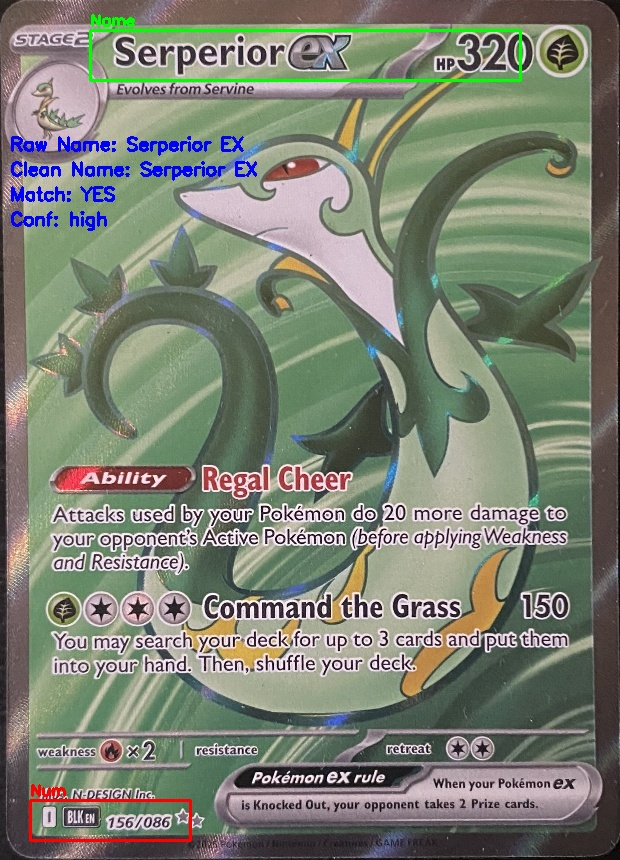

# Pokemon Card Scanner

**Goal**: Build a production-grade system to digitize physical Pokemon cards from raw photos into structured data.

**Current State**: Phase 4 (Batch Processing) Complete. The backend logic is fully functional, optimized, and verified.

---

## 🏗 Core Architecture

The project is built as a modular pipeline where data flows through specialized services in `src/card_annotation_tool/`:

| Component | File | Responsibility | Key Tech | Status |
| :--- | :--- | :--- | :--- | :--- |
| **Annotator** | `annotator.py` | GUI for creating Ground Truth data (corner labels). | Tkinter | Stable |
| **Rectifier** | `rectifier.py` | Unwarps raw photos to a standard **600x840** geometry. | OpenCV | Critical (Foundation) |
| **ROI Explorer** | `roi_explorer.py` | Slices the standard card into zones (Name, Number, Set). | NumPy (In-Memory) | Optimized (No Disk I/O) |
| **OCR Service** | `ocr_service.py` | Reads text from slices. | PaddleOCR (Mobile v4) | Optimized (~1.6s/ROI) |
| **Orchestrator**| `pipeline_manager.py`| Runs the batch process across the dataset. | `tqdm`, CSV | Production Ready |

**Annotator Keybinds:**

| Action | Key | Description |
| :--- | :--- | :--- |
| Confirm / Next | `Enter` | Validate & save |
| Undo | `Backspace` | Remove last point |
| Skip | `Esc` | Skip current image |
| Quit | `Q` | End program |
| Reset | `R` | Clear all corners |

## 💾 Data Management

*   **Golden Master**: `data/manifests/dataset.csv`
    *   The source of truth for file paths and verified corner coordinates.
    *   **Raw Images**: [Google Drive Folder](https://drive.google.com/drive/folders/1CeDqJJAuWPVTpOQ87DI8RhH4RQ_SUgi4?usp=drive_link)
*   **Pipeline Output**: `data/pipeline_output/pipeline_results.csv`
    *   The results of the batch run, containing extracted data and confidence flags.

## 🚀 Technical Wins

1.  **Original-Space Truth**: We map everything back to the raw image logic but operate in a standardized "Digital Twin" space (600x840).
2.  **Latency Optimization**:
    *   **Mobile Models**: Switched to `PP-OCRv4` Mobile for a ~30% speedup.
    *   **Zero-Copy**: `roi_explorer` passes NumPy arrays directly to OCR without saving to disk.
    *   **Logic Pruning**: Disabled `angle_classification` because the Rectifier guarantees upright images.
3.  **Robustness**: The pipeline handles missing files, bad paths, and OCR failures without crashing, using atomic CSV writing to save progress.

## 🗺 Current Status & Roadmap

### ✅ Phase 1-4: Complete (Backend Pipeline)
The core OCR pipeline is functional with optimized performance and card matching capabilities.

### 🎯 Phase 5: Card Matching System (IN PROGRESS)
**Status**: Functional with 20% automatic match rate

**What's Working:**
- Pokemon TCG API integration for card identification
- Smart OCR text cleaning:
  - Card number extraction (filters "BLK EN" garbage, extracts "054/086" pattern)
  - Pokemon name suffix detection (handles EX, GX, V, VMAX, VSTAR)
  - Handles concatenated suffixes ("Serperiorex" → "Serperior EX")
- Name-based fuzzy matching with confidence scoring
- 24 high-confidence matches from 121 processed cards

**Bottleneck**: OCR accuracy on holographic/special finish cards
- Name header ROI positioning is correct (verified via visualization)
- Issue is text recognition quality, not ROI placement

**Tools Created:**
- `card_matcher.py` - Pokemon TCG API integration
- `analyze_matches.py` - Batch card matching analyzer
- `visualize_rois.py` - ROI debugging tool (shows extraction boxes on cards)

### Visual Debug Example

### Phase 6: The Real-Time Auto-Detector
Replace manual corner annotation with an Automatic Card Detector (OpenCV contours or YOLO) to find card edges instantly in a camera frame.

### Phase 7: The "Live" API & Frontend
*   **FastAPI Backend**: `POST /scan` -> Image to JSON.
*   **Frontend**: React/Next.js UI for point-and-scan functionality.

### Phase 8: Collection Management
*   **Database Integration**: Save scans to "Binder" folders.
*   **Analytics**: Track collection value over time.

---

*This project demonstrates advanced computer vision, OCR optimization, API integration, and production-ready software architecture.*
